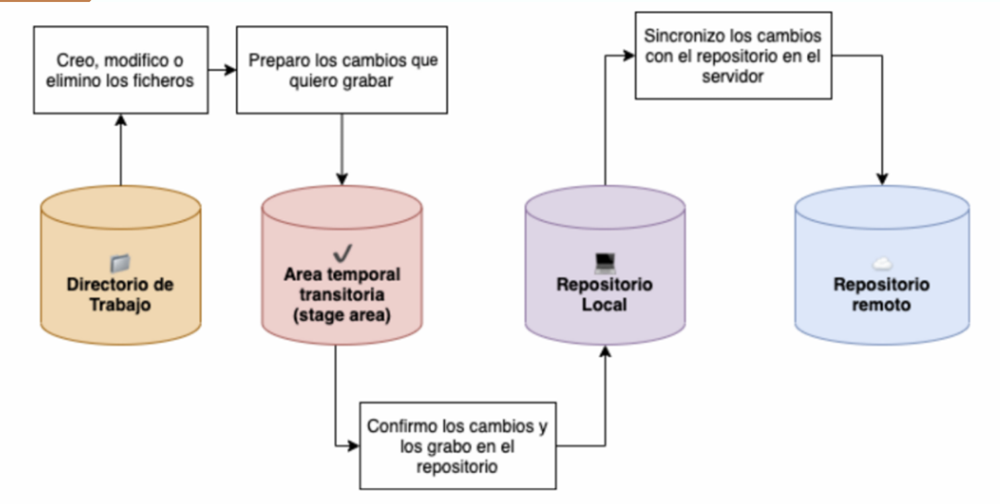

# Trabajo Individual


*Josue Joel Lizarazu Fernández*

## Clase 1 - 20 de abril, 2026

### ¿Qué es GIT?

Es un *sistema de control de versiones distribuido*, que nos permite guardar archivos y sus versiones a medidad que pasa el tiempo.

### ¿Cómo nació GIT?

Git nació porque, al principio, *Linus Torvalds* y los desarrolladores del kernel de Linux intercambiaban los cambios por correo, pero esa forma de trabajo no era muy eficiente para un proyecto tan grande.
Después empezaron a usar *BitKeeper*, que les ayudaba a organizar mejor las versiones. Sin embargo, años después se rompió la relación con la empresa de BitKeeper y se retiró el uso gratuito de la herramienta para el proyecto Linux.
Entonces Linus decidió crear su propia alternativa. De ahí nació Git.

### ¿Cómo instalar GIT?

#### Linux 
1. En el navegador buscar "Download GIT"
2. Buscar la distribución 
3. Copiar el comando y pegarlo en la terminal. Ejemplo: 
``` 
sudo apt install git 
```
4. Probar con:
```
git --version
```

#### Windows
1. En el navegador buscar "Download GIT"
2. Entrar a la pestaña "Windows"
3. Buscar la arquitectura de nuestra máquina y hacer clic en el instalador
4. Ejecutar el instalador y continuar con los pasos

### Configuraciones Básicas

+ Mostrar toda la *configuración actual* de Git, tanto general como del repositorio si existe.

```
git config --list 

```

+ Abrir la *ayuda de Git* del comando config

```
git config --help
```

+ Configurar *nombre de usuario* de forma global para todos tus repositorios en tu computadora.

```
git config --global user.name "nombredeusuario"
```

+ Configurar *correo electrónico* de forma global para todos tus respositorios.

```
git config --global user.email "nombre@correo.com"
```

+ Mostrar únicamente la configuración global de Git

``` bash
git config --global --list
```

+ Configura a Git para corregir automáticamente los *saltos de línea* de los archivos, evitando problemas entre Windows y otros sistemas operativos.

``` bash
git config --global core.autocrlf true
```

### Archivos que todo repositorio debería tener

+ **README.md**
Es un archivo de presentación y explicación del proyecto. Sirve para poner información como nombre del proyecto, autor, descripción, apuntes o avances, instrucciones de uso e imágenes.

+ **.gitignore**
Es un archivo que le dice a Git qué archivos no debe seguir ni subir al repositorio. 

### Inicializar un repositorio

Inicializa un repositorio Git en la carpeta actual. Conviete una carpeta común en una carpeta controlada por Git para usar commits, ramas y seguimiento de cambios.

``` bash
git init
```

Crea la carpeta oculta *.git* donde Git guarca toda la información del repositorio. Desde ese momento ya podemos usar comandos como *git add*, *git commit*, etc.

### Agregar archivo
Agregar el archivo README.md al área de preparación de Git.

``` bash
git add README.md
```

Confirmar este cambio:

``` bash
git commit -m "Primer commit"
```

### Sistema de puntuación - Fase 2
+ Examen: 50 pts
+ Trabajo Grupal (4 integrantes): 30 pts
+ Trabajo Individual: 10 pts
+ Asistencia: 9 pts
+ Forms del 19 de abril: 1 pts
Total: 100 pts

#### Examen
Examen presencial escrito en base a lo enseñado en clase. Contenido respecto a GIT

#### Trabajo Grupal
Grupos de 4 integrantes desarrollaran un mini proyecto a su elección que será presentado máximo hasta el día sábado 2 de mayo a horas 21:00. Calificación:
+ Participación de todos los miembros
+ Uso de GIT FLOW
+ Uso de buenas prácticas (en commits, ramas, etc)
+ README.md debe contener el nombre del equipo, integrantes, describir el mini-proyecto, y también incluir las instrucciones necesarias para ejecutar el proyecto de manera exitosa.

#### Trabajo Individual
Tener un repositorio desde el día 1. Tener un README.md, que debe contener el nombre y apuntes diarios. Se revisará los commits diarios.

#### Asistencia
Cada día se enviará un form en cualquier hora de la clase, disponible de 5 a 10 mins.

#### Aprobación
Puntaje mínimo 65 pts sobre 100 en total.

## STATES Y COMMITS (Clase 2 - 21 de abril, 2026)
### Los estados de GIT
1. *Directorio de Trabajo (Modificado)*: Tu carpeta local. Estás escribiendo código, pero Git aún no lo tiene "asegurado". Esto es después del git init. Git ve lo que estamos haciendo.
2. *Stage Area (Preparado)*: El área de espera. Le dices a Git: "Esto es lo que quiero guardar".
3. *Repositorio Local (Confirmado)*: El historial. Tus cambios ya tienen un ID (hash) y son parte de la historia. Pasan a un punto de guardado, en el historial o logs.

*Diagrama de cómo funcionan los estados de GIT:*



#### Directorio de trabajo (Modificado)
Es nuestra carpeta común, con la diferencia que GIT observa nuestros archivos y los cataloga en dos estados:

+ *Untracked (Sin seguimiento)*: Lo ve pero no tiene una versión antigua de este archivo, sucede cuando este es creado.
+ *Modified*: Es cuando GIT ya tiene una versión previa del archivo y lo modificaste, eliminaste o cambiaste de nombre.

Cualquier archivo que no este en el .gitignore pasa automaticamente a uno de estos estados dependiendo que hayamos hecho.

*¿Qué pasa si quiero que el archivo que modifique vuelva a su estado original? (Que pase de "Modified" a su estado original)*

``` bash
git restore <archivo>
```

Esto borra físicamente lo que escribieron, así que debemos tener cuidado.

*¿Qué pasa si quiero que el archivo que creé no quiero que lo vea GIT?*
Lo unico que debemos hacer es agregar el nombre del archivo completo al .gitignore.

#### Stage Area (Preparado)
Permite seleccionar qué archivos modificados se incluirán en el siguiente commit (guardado) y cuáles no.

Para traer un archivo al stage area lo que debemos hacer es:
``` bash
git add <archivo> // Agrega el archivo <archivo>, lo hace uno por uno
```
``` bash
git add . // Agrega todos los archivos que esten observados por GIT.
```
Si queremos sacar un archivo del stage area para volver al estado anterior:
``` bash
git restore --staged <archivo>
```

#### Repositorio Local (Confirmado)
Esta es la última fase, aquí es donde le decimos al repositorio que cree el punto de guardado para que todos los cambio que estan en staged pasen a ser parte del historial.
```
git commit -m "mensaje"
```
Si queremos deshacer el último commit el comando simple es:
```
git reset --soft HEAD~1
```
### Buenas prácticas

**¿Cada cuánto conviene hacer un commit?**

Lo recomendable es hacer commits frecuentes, pero con sentido.  
Cada commit debería representar un cambio pequeño, claro y completo dentro del proyecto.

No se trata de guardar por guardar, sino de registrar avances que tengan lógica.  
Es mejor tener varios commits pequeños y entendibles, que un solo commit grande con muchos cambios mezclados.

Una buena regla es esta:  
si puedes describir el cambio en una sola idea, probablemente merece su propio commit.

Por ejemplo:
- corregir un error puntual
- agregar una nueva funcionalidad pequeña
- mejorar el diseño de una sección
- actualizar documentación
- refactorizar una parte específica del código

Así, si en algún momento algo falla, será más fácil identificar qué cambio lo causó y volver atrás si es necesario.

---
#### Cómo escribir buenos commits

Un mensaje de commit debe ser corto, directo y fácil de entender.  
La idea es que cualquier persona pueda leer el historial y comprender qué se hizo sin revisar primero el código.

#### Recomendaciones generales

1. **Usa verbos que indiquen acción**
   El mensaje debe expresar claramente qué hiciste.

Ejemplos:
- `Add login form`
- `Fix error in navbar`
- `Update README`
- `Remove unused styles`

2. **Sé breve y específico**
   No escribas mensajes demasiado largos en el título del commit.

3. **Haz que cada commit tenga un único propósito**
   Si cambias muchas cosas distintas al mismo tiempo, conviene separarlas en varios commits.

4. **Evita mensajes vagos**
   Mensajes como `cambios`, `arreglos`, `update` o `cosas nuevas` no ayudan a entender el historial.

---

#### Ejemplos de mensajes de commit

```bash
git commit -m "Add user login validation"
```
Crea un commit con un mensaje breve que resume el cambio.
```bash
git commit -m "Fix sidebar on mobile"
```
Guarda una corrección puntual dentro del proyecto.
```bash
git commit -m "Update installation guide"
```
Registra una mejora hecha en la documentación.

#### Usa mensajes cortos

Como regla general, trata de que el mensaje principal no sea demasiado largo.
Si necesitas explicar muchas cosas, probablemente ese commit contiene varios cambios y conviene dividirlo.

Un mensaje corto y claro hace que el historial sea más fácil de leer.
